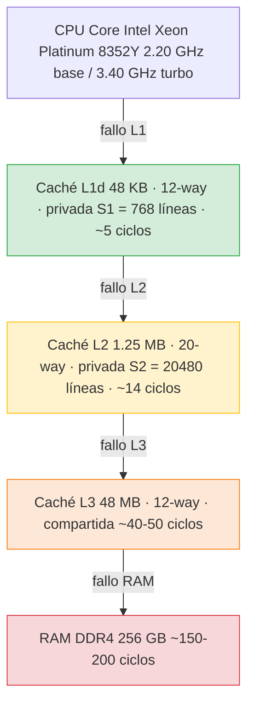
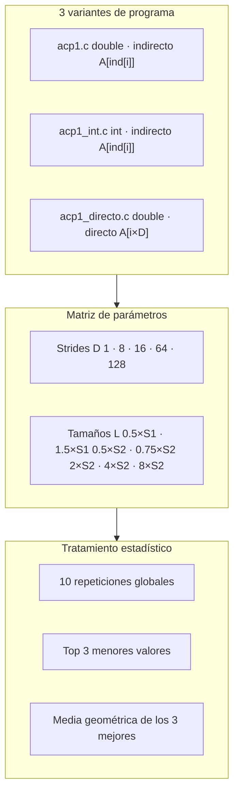
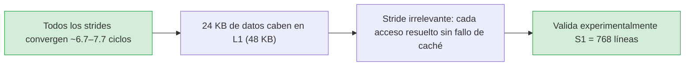
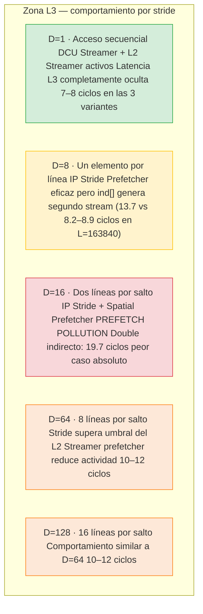

# Análisis de Resultados Experimentales
## Jerarquía de Memoria: Intel Ice Lake (FinisTerrae III)

**Asignatura**: Arquitectura de Computadores  
**Práctica**: Estudio del efecto de la localidad de los accesos a memoria  
**Plataforma**: FinisTerrae III (CESGA) — Intel Xeon Platinum 8352Y  
**Jobs ejecutados**: 5366644 (double indirecto) + experimentos adicionales int y directo

---

## 1. Arquitectura del sistema

Línea de caché (CLS) = 64 bytes. Experimentos ejecutados en **1 solo core** para garantizar que L1 y L2 son privadas y no hay contención con otros procesos.

---

## 2. El prefetcher hardware del Intel Ice Lake (Sunny Cove)

El procesador Intel Xeon Platinum 8352Y implementa la microarquitectura **Sunny Cove** (Ice Lake-SP), que incluye **cuatro prefetchers hardware** independientes controlables mediante el registro MSR 0x1A4:

### Prefetchers de L1 (cargan datos desde L2 → L1)

**DCU Streamer (Next-Line Prefetcher):** Detecta accesos ascendentes a datos recientemente cargados e interpreta ese patrón como un algoritmo de streaming. Automáticamente precarga la siguiente línea de caché. Es el más simple y se activa con cualquier acceso secuencial.

**DCU IP-based Stride Prefetcher:** Rastrea instrucciones de carga individuales. Cuando una instrucción de carga muestra un stride regular, emite una precarga a la siguiente dirección calculada como `dirección_actual + stride`. Puede detectar strides de hasta 2 KB tanto en dirección ascendente como descendente. Este es el prefetcher que explica los buenos resultados observados con D=8 y D=16 en las zonas L1 y L2.

### Prefetchers de L2 (cargan datos desde L3 → L2)

**L2 Streamer:** Monitoriza secuencias ascendentes y descendentes de peticiones desde L1 (tanto loads/stores como prefetches del propio L1). Cuando detecta un stream, precarga líneas anticipadas. Puede correr hasta **20 líneas por delante** del acceso actual, gestiona hasta **32 streams simultáneos** (un stream positivo y uno negativo por cada página de 4 KB), y ajusta dinámicamente la profundidad de prefetch según la carga del sistema. No cruza límites de página de 4 KB.

**L2 Spatial (Adjacent Cache Line) Prefetcher:** Completa cada línea de caché cargada en L2 con su línea adyacente, de modo que siempre haya un bloque de 128 bytes alineado completo. Actúa independientemente del patrón de acceso.

### Implicaciones para los experimentos

Con acceso secuencial (D=1), los cuatro prefetchers actúan coordinadamente: el DCU Streamer detecta el patrón, el IP Stride lo confirma, y el L2 Streamer garantiza que las líneas están en L2 mucho antes de que L1 las necesite. El resultado es la latencia casi plana observada incluso con 10 MB de datos.

Con D=16 (stride de 2 líneas), el IP Stride Prefetcher detecta el patrón y emite precargas, pero el L2 Spatial Prefetcher también actúa trayendo líneas adyacentes que nunca se usarán, generando el fenómeno de **prefetch pollution** que explica el peor caso observado.

Con D=64 y D=128, el stride supera la capacidad de detección eficiente del L2 Streamer (que opera por páginas de 4 KB) y el sistema reduce la profundidad de prefetch o deja de emitirlo, lo que paradójicamente mejora el rendimiento respecto a D=16 al evitar el tráfico inútil.

---

## 3. Diseño experimental

Cada variante ejecuta las **35 combinaciones** (5 strides × 7 tamaños), con 10 repeticiones externas → 1050 mediciones totales.

---

## 4. Footprint real en caché por valor de L

El parámetro L define el número de líneas de caché distintas que el programa referencia. El footprint en bytes es simplemente `L × 64` y determina en qué nivel de la jerarquía residen los datos durante la ejecución, **independientemente del stride D y del tipo de dato**.

> **Nota sobre la memoria reportada por Slurm:** El sistema Slurm reporta memoria RSS del sistema operativo (páginas físicas del SO tocadas), no el footprint en caché. Con stride D=128 y L=163840, solo se tocan R=10.240 posiciones de `A[]`, lo que explica que Slurm reporte apenas ~100 KB de memoria del sistema pese a que el footprint en caché es de 10 MB. Ambas métricas miden cosas distintas.

| L (líneas) | Fracción | Bytes referenciados | Nivel real |
|:---:|:---:|:---:|:---:|
| 384 | 0.5 × S1 | 384 × 64 = **24 KB** | **L1** (48 KB) ✓ holgado |
| 1152 | 1.5 × S1 | 1152 × 64 = **72 KB** | **L2** (1.25 MB) ✓ · desborda L1 |
| 10240 | 0.5 × S2 | 10240 × 64 = **640 KB** | **L2** ✓ · holgado (51%) |
| 15360 | 0.75 × S2 | 15360 × 64 = **960 KB** | **L2** ✓ · ajustado (77%) |
| 40960 | 2 × S2 | 40960 × 64 = **2.5 MB** | **L3** (48 MB) · desborda L2 |
| 81920 | 4 × S2 | 81920 × 64 = **5 MB** | **L3** ✓ |
| 163840 | 8 × S2 | 163840 × 64 = **10 MB** | **L3** ✓ (+ ind[] suma ~5–15 MB) |

Los valores L > S2 se denominan en este informe **"zona L3"** porque los datos desbordan L2 pero quedan dentro de los 48 MB de L3. Las latencias observadas (~8–20 ciclos) son consistentes con acceso a L3 mediado por el prefetcher, no con latencia pura de RAM (~150–200 ciclos). Solo con accesos completamente aleatorios se llegaría a necesitar RAM.

---

## 5. Tablas de resultados

> Valores en **ciclos de CPU por acceso** (media geométrica de los 3 mejores de 10 repeticiones).  
> 🟢 < 7.5 ciclos · 🟡 7.5–9.0 ciclos · 🔴 > 9.0 ciclos

### 5.1 Double + acceso indirecto (experimento base)

| L (líneas) | Zona real | D=1 | D=8 | D=16 | D=64 | D=128 |
|:---:|:---:|:---:|:---:|:---:|:---:|:---:|
| 384 | L1 | 🟢 7.53 | 🟢 7.70 | 🟢 7.63 | 🟢 7.64 | 🟢 7.36 |
| 1152 | L2 | 🟢 7.55 | 🟢 7.72 | 🟢 7.74 | 🟢 7.72 | 🟢 7.81 |
| 10240 | L2 | 🟢 7.61 | 🟢 7.79 | 🟢 7.85 | 🟢 7.88 | 🟢 7.95 |
| 15360 | L2 | 🟢 7.69 | 🟢 7.93 | 🟡 8.08 | 🟡 8.18 | 🟡 8.09 |
| 40960 | L3 | 🟢 7.82 | 🟡 8.50 | 🔴 9.94 | 🔴 9.98 | 🔴 10.22 |
| 81920 | L3 | 🟢 7.95 | 🔴 9.16 | 🔴 11.25 | 🔴 10.71 | 🔴 10.52 |
| 163840 | L3 | 🟢 7.93 | 🔴 13.74 | 🔴 19.75 | 🔴 12.20 | 🔴 11.77 |

### 5.2 Int + acceso indirecto (experimento adicional 1)

| L (líneas) | Zona real | D=1 | D=8 | D=16 | D=64 | D=128 |
|:---:|:---:|:---:|:---:|:---:|:---:|:---:|
| 384 | L1 | 🟢 6.84 | 🟢 7.05 | 🟢 7.11 | 🟢 7.13 | 🟢 7.12 |
| 1152 | L2 | 🟢 6.88 | 🟢 7.00 | 🟢 7.43 | 🟢 7.42 | 🟢 7.45 |
| 10240 | L2 | 🟢 6.98 | 🟢 6.98 | 🟢 7.45 | 🟢 7.41 | 🟢 7.55 |
| 15360 | L2 | 🟢 7.01 | 🟢 6.99 | 🟢 7.50 | 🟢 7.46 | 🟢 7.59 |
| 40960 | L3 | 🟢 7.05 | 🟢 7.18 | 🟢 7.81 | 🔴 9.45 | 🟡 8.34 |
| 81920 | L3 | 🟢 7.06 | 🟢 7.33 | 🟢 7.89 | 🔴 10.25 | 🔴 8.98 |
| 163840 | L3 | 🟢 7.04 | 🟡 8.16 | 🟡 8.87 | 🔴 11.80 | 🔴 9.54 |

### 5.3 Double + acceso directo (experimento adicional 2)

| L (líneas) | Zona real | D=1 | D=8 | D=16 | D=64 | D=128 |
|:---:|:---:|:---:|:---:|:---:|:---:|:---:|
| 384 | L1 | 🟢 7.32 | 🟢 7.18 | 🟢 7.09 | 🟢 6.73 | 🟢 6.74 |
| 1152 | L2 | 🟢 7.26 | 🟢 7.29 | 🟢 7.43 | 🟢 7.16 | 🟢 7.11 |
| 10240 | L2 | 🟢 7.44 | 🟢 7.40 | 🟢 7.45 | 🟢 7.39 | 🟢 7.43 |
| 15360 | L2 | 🟢 7.44 | 🟢 7.48 | 🟢 7.58 | 🟢 7.49 | 🟢 7.62 |
| 40960 | L3 | 🟢 7.50 | 🟢 7.80 | 🟡 8.71 | 🟡 8.61 | 🟡 8.36 |
| 81920 | L3 | 🟢 7.53 | 🟢 7.88 | 🔴 9.55 | 🔴 9.02 | 🟡 8.77 |
| 163840 | L3 | 🟢 7.61 | 🟡 8.86 | 🔴 11.30 | 🔴 10.02 | 🔴 9.86 |

---

## 6. Gráficas de resultados

### 6.1 Comparativa global de los tres experimentos

Cada panel muestra las 5 curvas de stride para una variante. Las líneas verticales rojas y verdes marcan los límites físicos de L1 (S1=768) y L2 (S2=20480). A partir de S2 los datos residen en L3. La variante double indirecto presenta los valores más altos en zona L3 con strides medios; la int indirecto los más bajos para D=1.

### 6.2 Comparación de variantes para D=1 (mejor caso de prefetching)

Con acceso secuencial, las tres variantes se mantienen casi planas incluso en L3. El DCU Streamer y el L2 Streamer actúan coordinadamente ocultando por completo la latencia de L3 (~40-50 ciclos teóricos). La versión int alcanza el mínimo (~7.04 ciclos) y la double indirecta el máximo (~7.93 ciclos) en L=163840.

### 6.3 Comparación de variantes para D=16 (peor caso observado)

Con stride D=16, las diferencias entre variantes son máximas. La versión double indirecta llega a **19.75 ciclos**, mientras que la int indirecta se queda en 8.87 y la double directa en 11.30. El IP Stride Prefetcher detecta el patrón pero genera prefetch pollution al actuar conjuntamente con el Spatial Prefetcher, trayendo el doble de líneas necesarias.

---

## 7. Análisis por zonas de la jerarquía

### 7.1 Zona L1 — L ≤ 768 líneas (footprint ≤ 24 KB)

Las cinco curvas de cualquier variante son indistinguibles. La ligera ventaja de `int` (~0.3 ciclos menos) se debe a que la suma entera (`ADD`) es marginalmente más barata en la ALU que la suma en punto flotante (`FADD`).

### 7.2 Zona L2 — 768 < L ≤ 20480 líneas (footprint 72 KB – 960 KB)

Al superar S1, los datos desbordan L1 y se producen fallos que resuelve L2. La penalización es mínima gracias al **DCU IP Stride Prefetcher**: detecta el stride constante del bucle y emite precargas a L1 antes de que sean necesarias, ocultando la latencia teórica de L2 (~14 ciclos). Los valores apenas suben respecto a la zona L1 en todas las variantes. La primera curva en degradarse al entrar en L2 es D=128 en la versión double indirecta (~7.81 ciclos en L=1152), porque saltos de 1024 bytes dificultan la predicción del stride prefetcher.

### 7.3 Zona L3 — L > 20480 líneas (footprint > 1.25 MB)

---

## 8. Análisis comparativo de las tres variantes

### 8.1 Double indirecto vs. Int indirecto

Usar `int` (4 bytes) en lugar de `double` (8 bytes) no cambia el número de líneas L referenciadas, pero sí el tamaño del vector de índices `ind[]` en relación al trabajo útil realizado.

**Int es más rápido en D=1 y D=8 en zona L3.** Para `int`, R es el doble que para `double`, pero el ratio entre bytes de datos y bytes de índices es más favorable: `ind[]` consume menos espacio relativo en caché, reduciendo la contención. Además, con más elementos por línea el IP Stride Prefetcher tiene más datos útiles por cada línea traída.

**Int es más lento en D=64 y D=128 en zona L3.** Con R_int = 2×R_double y strides grandes, `ind[]` se vuelve enorme. Para L=163840 y D=64, la versión int tiene R=327.680 elementos → `ind[]` ocupa ~1.25 MB, exactamente el tamaño de L2, desbordándola solo con los índices y forzando accesos adicionales a L3.

### 8.2 Double directo vs. Double indirecto

La comparación más reveladora. Diferencias máximas en D=8 y D=16 en zona L3 profunda:

| Configuración | Directo | Indirecto | Mejora |
|:---:|:---:|:---:|:---:|
| D=1, L=163840 | 7.61 | 7.93 | −4% |
| D=8, L=163840 | 8.86 | 13.74 | **−36%** |
| D=16, L=163840 | 11.30 | 19.75 | **−43%** |
| D=64, L=163840 | 10.02 | 12.20 | −18% |
| D=128, L=163840 | 9.86 | 11.77 | −16% |

Dos efectos acumulativos explican la mejora del acceso directo: elimina el segundo stream de memoria (el acceso indirecto genera dos flujos simultáneos — uno para `ind[i]` y otro para `A[]` — que dividen los recursos del L2 Streamer entre dos patrones) y libera capacidad de caché (para L=163840 y D=1, `ind[]` ocupa ~5 MB, cuatro veces L2, espacio que en el acceso directo queda íntegramente disponible para `A[]`).

---

## 9. Resumen cuantitativo en zona L3 profunda (L=163840)

```mermaid
xychart-beta
    title "Ciclos/acceso en L3 profunda (L=163840) por stride y variante"
    x-axis ["D=1", "D=8", "D=16", "D=64", "D=128"]
    y-axis "Ciclos por acceso" 0 --> 22
    bar [7.93, 13.74, 19.75, 12.20, 11.77]
    bar [7.04, 8.16, 8.87, 11.80, 9.54]
    bar [7.61, 8.86, 11.30, 10.02, 9.86]
```

> Barras por grupo de izquierda a derecha: azul = Double indirecto · naranja = Int indirecto · morado = Double directo

El rango observable va de **7.04 ciclos** (int indirecto, D=1) a **19.75 ciclos** (double indirecto, D=16): un factor **2.8×** entre el mejor y el peor caso con los mismos datos en L3.

---

## 10. Ausencia de la "escalera" clásica

Los libros de texto predicen latencias bien diferenciadas por nivel (~5, ~14, ~40, ~150 ciclos). Los resultados permanecen en el rango **7–20 ciclos** incluso para datos en L3. Hay dos razones:

La primera es que los datos experimentales nunca llegan a RAM: el footprint máximo es de 10 MB (L=163840), que cabe dentro de los 48 MB de L3 compartida. La latencia de L3 (~40-50 ciclos teóricos) no se observa directamente porque la segunda razón la enmascara.

La segunda es el prefetcher hardware: incluso accediendo a L3, el L2 Streamer corre hasta 20 líneas por delante del acceso actual y ajusta dinámicamente su profundidad, trayendo datos a L2 y L1 antes de que sean necesarios. Con D=1 esto es casi perfecto y la latencia de L3 queda completamente oculta. La escalera solo emerge con accesos aleatorios que frustran todos los prefetchers simultáneamente.

---

## 11. Conclusiones

**1. Los datos nunca llegan a RAM en estos experimentos.** El footprint máximo (L=163840 → 10 MB) cabe en L3 (48 MB). Los efectos observados son de L3, no de RAM.

**2. La localidad espacial es el factor dominante en zona L3.** La diferencia entre D=1 (~7 ciclos) y D=16 (~20 ciclos en el peor caso) supone un factor 2.8×, enteramente atribuible a la interacción con los cuatro prefetchers hardware.

**3. D=16 es el stride más perjudicial.** Con un salto de exactamente 2 líneas de caché, el IP Stride Prefetcher y el Spatial Prefetcher actúan juntos generando tráfico al doble de la tasa necesaria (*prefetch pollution*), saturando el ancho de banda L2↔L3.

**4. Strides grandes (D=64, D=128) son paradójicamente mejores que D=16.** Cuando el stride supera el umbral de detección eficiente del L2 Streamer, el prefetcher reduce su actividad evitando el overhead de predicciones erróneas.

**5. El acceso indirecto impone un coste real en zona L3.** Eliminar `ind[]` (acceso directo) mejora entre un 4% y un 43% dependiendo del stride, con el mayor beneficio en D=8 y D=16, donde los dos streams de memoria simultáneos dividen los recursos del prefetcher.

**6. `int` vs `double` produce resultados similares para las mismas líneas L.** Las diferencias provienen del tamaño de `ind[]`: ventaja para `int` en strides pequeños (menor contención) y desventaja en strides grandes (R_int = 2×R_double → mayor presión sobre L2 con los índices).

**7. El prefetcher del Ice Lake (Sunny Cove) es extraordinariamente eficaz.** Con acceso secuencial (D=1), la latencia de L3 (~40-50 ciclos teóricos) queda completamente oculta gracias a la coordinación del DCU Streamer, IP Stride y L2 Streamer, y el programa se comporta como si todo residiera en L1.

---

*FinisTerrae III (CESGA) · Intel Xeon Platinum 8352Y (Ice Lake / Sunny Cove) · gcc -O0 · 10 repeticiones × 35 combinaciones × 3 variantes = 1050 mediciones totales · Métrica: media geométrica de los 3 mejores valores de ciclos/acceso.*