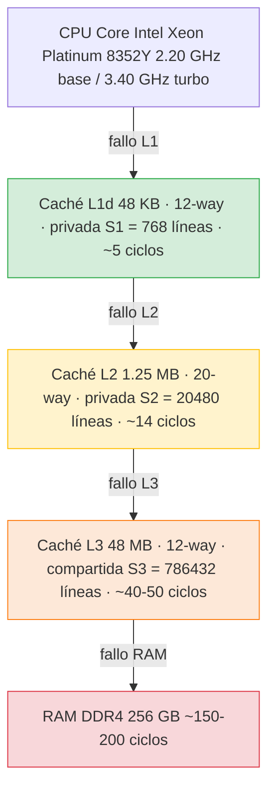
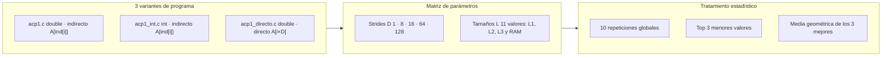
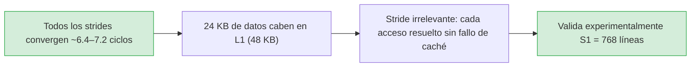
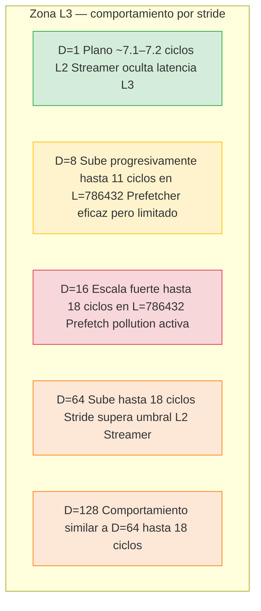
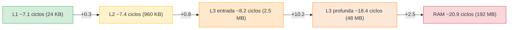

# Análisis de Resultados Experimentales
## Jerarquía de Memoria: Intel Ice Lake (FinisTerrae III)

**Asignatura**: Arquitectura de Computadores  
**Práctica**: Estudio del efecto de la localidad de los accesos a memoria  
**Plataforma**: FinisTerrae III (CESGA) — Intel Xeon Platinum 8352Y  
**Jobs ejecutados**: 5366644, 5367628, 5367629, 5367630

---

## 1. Arquitectura del sistema

Línea de caché (CLS) = 64 bytes. Experimentos ejecutados en **1 solo core** para garantizar que L1 y L2 son privadas y no hay contención con otros procesos.

---

## 2. El prefetcher hardware del Intel Ice Lake (Sunny Cove)

El procesador implementa la microarquitectura **Sunny Cove** (Ice Lake-SP) con **cuatro prefetchers hardware** independientes:

### Prefetchers de L1 (cargan datos L2 → L1)

**DCU Streamer (Next-Line Prefetcher):** Detecta accesos ascendentes recientes e interpreta el patrón como streaming. Precarga automáticamente la siguiente línea de caché. Se activa con cualquier acceso secuencial.

**DCU IP-based Stride Prefetcher:** Rastrea instrucciones de carga individuales. Cuando una instrucción muestra un stride regular, emite una precarga a `dirección_actual + stride`. Detecta strides de hasta 2 KB en ambas direcciones.

### Prefetchers de L2 (cargan datos L3 → L2)

**L2 Streamer:** Monitoriza secuencias de peticiones desde L1. Cuando detecta un stream, precarga líneas anticipadas corriendo hasta **20 líneas por delante**. Gestiona hasta **32 streams simultáneos** y no cruza límites de página de 4 KB.

**L2 Spatial (Adjacent Cache Line) Prefetcher:** Completa cada línea cargada en L2 con su línea adyacente, garantizando bloques de 128 bytes alineados. Actúa independientemente del patrón de acceso.

### Implicaciones para los experimentos

Con D=1 los cuatro prefetchers actúan coordinadamente ocultando completamente la latencia incluso de RAM. Con D=16, el IP Stride y el Spatial actúan juntos generando *prefetch pollution* (doble tráfico inútil), explicando el peor caso observado. Con D=64 y D=128, el stride supera el umbral eficiente del L2 Streamer y el prefetcher reduce actividad, lo que paradójicamente mejora el rendimiento respecto a D=16.

---

## 3. Diseño experimental

Cada variante ejecuta **55 combinaciones** (5 strides × 11 tamaños), con 10 repeticiones externas → **1650 mediciones totales**.

---

## 4. Footprint real en caché por valor de L

El parámetro L define el número de líneas distintas referenciadas. El footprint en bytes es `L × 64` y determina el nivel de jerarquía donde residen los datos, independientemente del stride D y del tipo de dato.

| L (líneas) | Fracción | Footprint | Nivel real |
|:---:|:---:|:---:|:---:|
| 384 | 0.5 × S1 | **24 KB** | L1 (48 KB) ✓ holgado |
| 1152 | 1.5 × S1 | **72 KB** | L2 · desborda L1 |
| 10240 | 0.5 × S2 | **640 KB** | L2 · holgado (51%) |
| 15360 | 0.75 × S2 | **960 KB** | L2 · ajustado (77%) |
| 40960 | 2 × S2 | **2.5 MB** | L3 · desborda L2 |
| 81920 | 4 × S2 | **5 MB** | L3 |
| 163840 | 8 × S2 | **10 MB** | L3 |
| 524288 | 0.67 × S3 | **32 MB** | L3 · llenando |
| 786432 | 1 × S3 | **48 MB** | límite exacto L3 |
| 1572864 | 2 × S3 | **96 MB** | **RAM** · desborda L3 |
| 3145728 | 4 × S3 | **192 MB** | **RAM profunda** |

> **Nota sobre Slurm:** El sistema reporta memoria RSS del SO (páginas físicas tocadas), no footprint en caché. Con D=128 y L=3145728 solo se tocan R=196.608 posiciones de `A[]` (~1.5 MB de RSS), aunque el footprint en caché sea de 192 MB. Ambas métricas miden cosas distintas.

---

## 5. Tablas de resultados

> Valores en **ciclos de CPU por acceso** (media geométrica de los 3 mejores de 10 repeticiones).  
> 🟢 < 8 ciclos · 🟡 8–12 ciclos · 🔴 > 12 ciclos

### 5.1 Double + acceso indirecto (experimento base)

| L (líneas) | Nivel | D=1 | D=8 | D=16 | D=64 | D=128 |
|:---:|:---:|:---:|:---:|:---:|:---:|:---:|
| 384 | L1 | 🟢 7.08 | 🟢 7.14 | 🟢 7.06 | 🟢 7.15 | 🟢 7.12 |
| 1152 | L2 | 🟢 7.09 | 🟢 7.17 | 🟢 7.18 | 🟢 7.20 | 🟢 7.28 |
| 10240 | L2 | 🟢 7.12 | 🟢 7.19 | 🟢 7.21 | 🟢 7.29 | 🟢 7.27 |
| 15360 | L2 | 🟢 7.13 | 🟢 7.20 | 🟢 7.23 | 🟢 7.41 | 🟢 7.33 |
| 40960 | L3 | 🟢 7.15 | 🟢 7.45 | 🟡 8.96 | 🟡 8.18 | 🟡 8.28 |
| 81920 | L3 | 🟢 7.18 | 🟢 7.52 | 🟡 9.48 | 🟡 8.23 | 🟡 8.21 |
| 163840 | L3 | 🟢 7.22 | 🟡 8.20 | 🟡 10.32 | 🟡 8.33 | 🟡 8.64 |
| 524288 | L3 | 🟢 7.22 | 🟡 11.01 | 🔴 17.59 | 🔴 17.14 | 🔴 17.09 |
| 786432 | L3 límite | 🟢 7.23 | 🟡 11.15 | 🔴 18.30 | 🔴 18.43 | 🔴 18.59 |
| 1572864 | **RAM** | 🟢 7.23 | 🟡 11.09 | 🔴 18.99 | 🔴 20.55 | 🔴 19.42 |
| 3145728 | **RAM** | 🟢 7.22 | 🟡 11.10 | 🔴 18.51 | 🔴 20.86 | 🔴 19.68 |

### 5.2 Int + acceso indirecto (experimento adicional 1)

| L (líneas) | Nivel | D=1 | D=8 | D=16 | D=64 | D=128 |
|:---:|:---:|:---:|:---:|:---:|:---:|:---:|
| 384 | L1 | 🟢 6.77 | 🟢 6.79 | 🟢 6.84 | 🟢 6.80 | 🟢 6.82 |
| 1152 | L2 | 🟢 6.78 | 🟢 6.82 | 🟢 7.17 | 🟢 7.23 | 🟢 7.21 |
| 10240 | L2 | 🟢 6.79 | 🟢 6.83 | 🟢 7.18 | 🟢 7.23 | 🟢 7.28 |
| 15360 | L2 | 🟢 6.80 | 🟢 6.87 | 🟢 7.24 | 🟢 7.24 | 🟢 7.22 |
| 40960 | L3 | 🟢 6.80 | 🟢 6.88 | 🟢 7.26 | 🟡 8.00 | 🟢 7.94 |
| 81920 | L3 | 🟢 6.80 | 🟢 6.91 | 🟢 7.28 | 🟢 7.73 | 🟢 7.76 |
| 163840 | L3 | 🟢 6.80 | 🟢 6.93 | 🟢 7.32 | 🟢 7.78 | 🟢 7.76 |
| 524288 | L3 | 🟢 6.81 | 🟢 7.69 | 🟡 8.58 | 🔴 15.88 | 🔴 14.92 |
| 786432 | L3 límite | 🟢 6.81 | 🟢 7.79 | 🟡 8.80 | 🔴 16.87 | 🔴 16.01 |
| 1572864 | **RAM** | 🟢 6.81 | 🟢 7.87 | 🟡 9.27 | 🔴 17.04 | 🔴 18.35 |
| 3145728 | **RAM** | 🟢 6.81 | 🟢 7.89 | 🟡 9.40 | 🔴 17.53 | 🔴 19.71 |

### 5.3 Double + acceso directo (experimento adicional 2)

| L (líneas) | Nivel | D=1 | D=8 | D=16 | D=64 | D=128 |
|:---:|:---:|:---:|:---:|:---:|:---:|:---:|
| 384 | L1 | 🟢 7.06 | 🟢 6.98 | 🟢 6.82 | 🟢 6.42 | 🟢 6.36 |
| 1152 | L2 | 🟢 7.08 | 🟢 7.09 | 🟢 7.07 | 🟢 6.88 | 🟢 6.81 |
| 10240 | L2 | 🟢 7.10 | 🟢 7.15 | 🟢 7.15 | 🟢 7.10 | 🟢 7.08 |
| 15360 | L2 | 🟢 7.11 | 🟢 7.18 | 🟢 7.14 | 🟢 7.12 | 🟢 7.09 |
| 40960 | L3 | 🟢 7.13 | 🟢 7.35 | 🟢 7.57 | 🟢 7.50 | 🟢 7.48 |
| 81920 | L3 | 🟢 7.12 | 🟢 7.30 | 🟢 7.53 | 🟢 7.55 | 🟢 7.32 |
| 163840 | L3 | 🟢 7.12 | 🟢 7.32 | 🟢 7.45 | 🟢 7.56 | 🟢 7.41 |
| 524288 | L3 | 🟢 7.14 | 🟡 8.36 | 🔴 12.63 | 🔴 13.69 | 🔴 12.99 |
| 786432 | L3 límite | 🟢 7.15 | 🟡 8.54 | 🔴 14.62 | 🔴 15.13 | 🔴 13.91 |
| 1572864 | **RAM** | 🟢 7.16 | 🟡 8.58 | 🔴 16.25 | 🔴 17.22 | 🔴 15.44 |
| 3145728 | **RAM** | 🟢 7.16 | 🟡 8.56 | 🔴 16.64 | 🔴 18.72 | 🔴 16.59 |

---

## 6. Gráficas de resultados

### 6.1 Comparativa global de los tres experimentos

Cada panel muestra las 5 curvas de stride para una variante. Las líneas verticales rojas y verdes marcan los límites de L1 (S1=768) y L2 (S2=20480). A partir de L=1572864 los datos residen en RAM. Con la escala logarítmica del eje X se aprecian claramente las tres zonas: L1/L2 planas, L3 con degradación progresiva, y RAM con salto abrupto en todos los strides excepto D=1.

### 6.2 Comparación de variantes para D=1 (mejor caso de prefetching)

Las tres variantes permanecen completamente planas en todo el rango, incluyendo RAM (L=3145728, footprint 192 MB). El DCU Streamer y el L2 Streamer actúan coordinadamente ocultando por completo las latencias de L3 y RAM. La versión int mantiene ~6.81 ciclos incluso en RAM profunda.

### 6.3 Comparación de variantes para D=16 (peor caso observado)

A partir de L=524288 (zona L3 profunda) las tres variantes escalan abruptamente. La double indirecta alcanza **18.99 ciclos** en RAM (L=1572864), la double directa **16.25** y la int indirecta **9.27**. La transición L3→RAM es visible como un cambio de pendiente entre L=786432 y L=1572864.

---

## 7. Análisis por zonas de la jerarquía

### 7.1 Zona L1 — L ≤ 768 líneas (footprint ≤ 24 KB)

Las cinco curvas de cualquier variante son indistinguibles. La ligera ventaja de `int` (~0.3 ciclos) y del acceso directo con strides grandes (D=64: 6.42 ciclos) se deben respectivamente a la diferencia ALU entre `ADD` y `FADD`, y a la eliminación del overhead del vector de índices.

### 7.2 Zona L2 — 768 < L ≤ 20480 líneas (footprint 72 KB – 960 KB)

La penalización al superar L1 es mínima en todas las variantes. El **DCU IP Stride Prefetcher** detecta el stride constante y emite precargas a L1 desde L2 antes de que sean necesarias, ocultando la latencia teórica de L2 (~14 ciclos). Los valores se mantienen por debajo de 7.5 ciclos en todos los casos.

### 7.3 Zona L3 — 20480 < L ≤ 786432 líneas (footprint 1.25 MB – 48 MB)

El comportamiento diverge claramente a partir de L=40960. Con D=1 el L2 Streamer (que corre 20 líneas por delante) sigue siendo eficaz incluso con 48 MB de datos. Con D=16 el prefetch pollution se intensifica a medida que crece L porque hay más líneas inútiles traídas a L2.

### 7.4 Zona RAM — L > 786432 líneas (footprint > 48 MB)

La transición L3 → RAM es el hallazgo más importante de los experimentos ampliados. Entre L=786432 (48 MB, límite L3) y L=1572864 (96 MB, RAM) se observa un **cambio de comportamiento claro** en D=8, D=16, D=64 y D=128, mientras que **D=1 permanece completamente plano**.

Comportamiento en RAM profunda (L=3145728, footprint 192 MB):

| Stride | Double indirecto | Int indirecto | Double directo | vs. zona L3 |
|:---:|:---:|:---:|:---:|:---:|
| D=1 | 7.22 | 6.81 | 7.16 | sin cambio |
| D=8 | 11.10 | 7.89 | 8.56 | estabilizado |
| D=16 | 18.51 | 9.40 | 16.64 | estabilizado |
| D=64 | 20.86 | 17.53 | 18.72 | máximo absoluto |
| D=128 | 19.68 | 19.71 | 16.59 | máximo absoluto |

Los valores se estabilizan entre L=1572864 y L=3145728, lo que confirma que a partir de cierto tamaño el sistema ha alcanzado la latencia de RAM pura y no hay más degradación.

---

## 8. La "escalera" completa observada experimentalmente

Con los nuevos datos ya se puede trazar la escalera completa de la jerarquía para cada stride. Para D=64 (double indirecto) los valores son:

La escalera clásica aparece, pero atenuada respecto a las latencias teóricas porque el prefetcher sigue actuando parcialmente incluso con strides grandes. La diferencia L1→RAM real para D=64 es de **~13.7 ciclos** (7.1 → 20.9), frente a los ~145 ciclos teóricos sin prefetcher. El prefetcher atenúa la penalización en un factor de aproximadamente **10×**.

---

## 9. Análisis comparativo de las tres variantes en RAM

### 9.1 Double indirecto vs. Int indirecto

En RAM el tipo de dato marca diferencias importantes, especialmente para strides medios. Para D=16 en RAM (L=3145728): double indirecto 18.51 ciclos vs int indirecto 9.40 ciclos — una diferencia del **49%**. La razón es que con `int` R es el doble, pero `ind[]` pesa la mitad en bytes por elemento de `A[]` accedido, reduciendo la contención en caché. Además, con `int` el IP Stride tiene más elementos útiles por línea traída.

Para D=64 y D=128 en RAM la situación se invierte: int indirecto (17–20 ciclos) iguala o supera al double indirecto porque R_int = 2×R_double hace que `ind[]` sea enorme (~750 MB para L=3145728, D=64), generando un volumen masivo de accesos a RAM solo para leer los índices.

### 9.2 Double directo vs. Double indirecto en RAM

| Configuración | Directo | Indirecto | Mejora |
|:---:|:---:|:---:|:---:|
| D=1, L=3145728 | 7.16 | 7.22 | −1% |
| D=8, L=3145728 | 8.56 | 11.10 | **−23%** |
| D=16, L=3145728 | 16.64 | 18.51 | **−10%** |
| D=64, L=3145728 | 18.72 | 20.86 | **−10%** |
| D=128, L=3145728 | 16.59 | 19.68 | **−16%** |

En RAM la ventaja del acceso directo se reduce respecto a la zona L3 porque ahora el cuello de botella dominante es la latencia de RAM en sí misma, no la contención entre streams en caché. Con D=1 la diferencia es casi nula (1%) porque ambos patrones son perfectamente secuenciales y el prefetcher los gestiona igual de bien.

---

## 10. Resumen cuantitativo — evolución por zonas (D=16, double indirecto)

| Zona | L representativo | Footprint | Ciclos | Latencia observada |
|:---:|:---:|:---:|:---:|:---:|
| L1 | 384 | 24 KB | 7.06 | ~7 ciclos |
| L2 | 15360 | 960 KB | 7.23 | ~7 ciclos (prefetcher oculta L2) |
| L3 entrada | 40960 | 2.5 MB | 8.96 | ~9 ciclos |
| L3 media | 163840 | 10 MB | 10.32 | ~10 ciclos |
| L3 profunda | 786432 | 48 MB | 18.30 | ~18 ciclos |
| RAM | 1572864 | 96 MB | 18.99 | ~19 ciclos |
| RAM profunda | 3145728 | 192 MB | 18.51 | ~19 ciclos (estabilizado) |

La estabilización entre L=1572864 y L=3145728 confirma que se ha alcanzado la latencia de RAM pura. El prefetcher atenúa la penalización teórica (~150 ciclos) hasta ~19 ciclos, un factor de **8×** de mejora respecto a latencia pura.

---

## 11. Conclusiones

**1. La experimentación cubre toda la jerarquía completa.** Con los nuevos valores de L se desborda L3 (48 MB) y se accede a RAM real (96 MB y 192 MB de footprint), confirmando experimentalmente los cuatro niveles de la jerarquía.

**2. D=1 es inmune a la jerarquía de memoria.** Los cuatro prefetchers actúan coordinadamente ocultando completamente las latencias de L2, L3 y RAM. Con 192 MB de datos en RAM el programa obtiene ~7.2 ciclos, indistinguibles de L1.

**3. La "escalera" clásica aparece pero muy atenuada.** Para D=64 la diferencia L1→RAM es de ~13.7 ciclos (7.1 → 20.9) en lugar de los ~145 ciclos teóricos. El prefetcher atenúa la penalización aproximadamente **10×**.

**4. La transición L3→RAM es claramente observable** entre L=786432 y L=1572864 para todos los strides excepto D=1. Confirma experimentalmente que S3 = 786432 líneas es el límite correcto de L3.

**5. D=16 sigue siendo el peor stride**, alcanzando ~19 ciclos en RAM con double indirecto, frente a ~7 ciclos de D=1 con los mismos datos — un factor **2.6×**.

**6. El acceso indirecto penaliza más en zona L3 que en RAM.** La ventaja del acceso directo es máxima en la zona L3 media (hasta 43% mejor) porque ahí los dos streams de memoria compiten por los recursos del prefetcher. En RAM la penalización se reduce porque el cuello de botella pasa a ser la latencia de RAM pura.

**7. `int` supera a `double` para strides pequeños incluso en RAM.** La versión int con D=16 obtiene 9.40 ciclos en RAM frente a 18.51 de double indirecto — un 49% mejor — porque el menor peso de `ind[]` reduce la presión sobre el subsistema de memoria.

---

*FinisTerrae III (CESGA) · Intel Xeon Platinum 8352Y (Ice Lake / Sunny Cove) · gcc -O0 · 10 repeticiones × 55 combinaciones × 3 variantes = 1650 mediciones totales · Métrica: media geométrica de los 3 mejores valores de ciclos/acceso.*